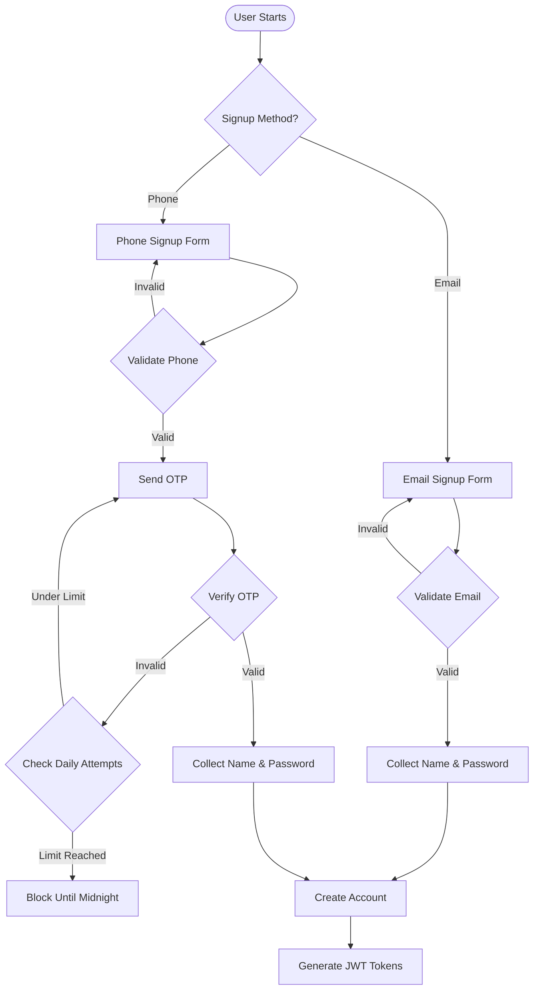
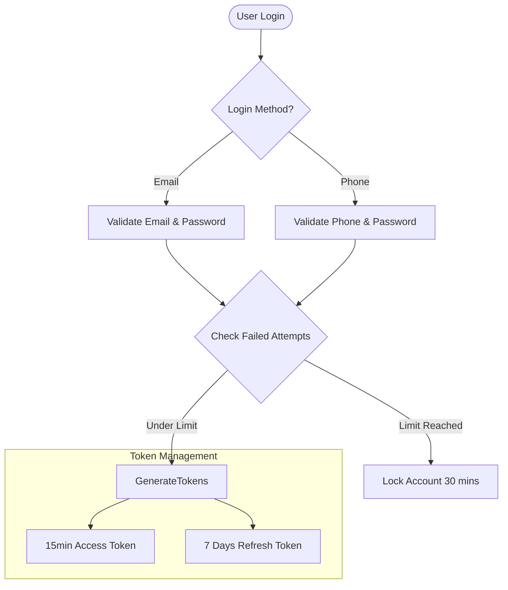

# Authentication System Documentation

## Table of Contents
1. [Overview](#overview)
2. [Authentication Methods](#authentication-methods)
3. [Registration Process](#registration-process)
4. [Login Process](#login-process)
5. [Phone Verification System](#phone-verification-system)
6. [Token Management](#token-management)
7. [Session Management](#session-management)
8. [Security Features](#security-features)
9. [Role-Based Access Control](#role-based-access-control)
10. [Error Handling](#error-handling)
11. [Audit Logging](#audit-logging)

## Overview

The authentication system implements a dual-method approach using both email and phone verification, secured with JWT tokens. The system prioritizes security while maintaining user experience through flexible verification options.

### System Architecture Flow



## Authentication Methods

### Email Authentication
- Email format validation
- Secure password requirements
- Required phone verification for order placement

### Phone Authentication
- International format validation
- OTP verification system
- Automatic verification status

## Registration Process

### Email Registration Flow
1. Email validation
2. User details collection
3. Password creation
4. Account creation
5. Token generation
6. Phone verification requirement flag

### Phone Registration Flow
1. Phone number validation
2. OTP verification
3. User details collection
4. Account creation
5. Token generation
6. Automatic phone verification

### User Data Structure
```javascript
{
  userId: "USER123",
  email: "user@example.com",
  phoneNumber: "+9779841234567",
  name: "John Doe",
  passwordHash: "bcrypt_hashed_password",
  phoneVerified: boolean,
  registrationMethod: "EMAIL" | "PHONE",
  createdAt: "2024-12-08T14:42:22Z"
}
```

## Login Process

### Login Flow Diagram



### Login Security Rules
- Maximum 5 failed attempts
- 30-minute account lock after exceeded attempts
- Device tracking and suspicious activity monitoring

## Phone Verification System

### OTP Management
```javascript
{
  phoneNumber: "+9779841234567",
  otp: "123456",
  expiresAt: "2024-12-08T14:52:22Z",
  attempts: 0,
  dailyAttempts: 1
}
```

### Verification Rules
- 10-minute OTP expiration
- 5 attempts per day maximum
- Midnight reset for daily attempts
- Alternative phone numbers supported

## Token Management

### Token Generation
```javascript
// Access Token Payload
{
  userId: "USER123",
  role: "CUSTOMER",
  permissions: ["order:create", "profile:read"],
  exp: 1670509942, // 15 minutes
  iat: 1670506342
}

// Refresh Token Payload
{
  userId: "USER123",
  tokenFamily: "abc123",
  exp: 1671111942, // 7 days
  iat: 1670506342
}
```

### Token Rules
- Access Token: 15-minute validity
- Refresh Token: 7-day validity
- Single active session per device
- Automatic token refresh mechanism

## Session Management

### Device Session Structure
```javascript
{
  userId: "USER123",
  deviceId: "DEVICE456",
  deviceType: "Mobile",
  lastLogin: "2024-12-08T14:42:22Z",
  ipAddress: "192.168.1.1",
  location: "Kathmandu, Nepal"
}
```

### Session Rules
- Forced logout on password change
- Geographic location tracking
- Device fingerprinting
- Suspicious activity monitoring

## Security Features

### Password Requirements
- Minimum 8 characters
- At least one uppercase letter
- At least one number
- At least one special character
- Password history tracking

### Security Alerts
```javascript
{
  type: "SUSPICIOUS_LOGIN",
  userId: "USER123",
  details: {
    reason: "Unknown location",
    severity: "HIGH",
    timestamp: "2024-12-08T14:42:22Z"
  }
}
```

## Role-Based Access Control

### Role Hierarchy
```javascript
const roles = {
  ADMIN: {
    inherits: ["MANAGER"],
    permissions: ["user:manage", "system:configure"]
  },
  MANAGER: {
    inherits: ["STAFF"],
    permissions: ["inventory:manage", "staff:manage"]
  },
  STAFF: {
    inherits: [],
    permissions: ["order:process", "kitchen:manage"]
  },
  CUSTOMER: {
    inherits: [],
    permissions: ["order:create", "profile:manage"]
  }
}
```

## Error Handling

### Authentication Errors
```javascript
{
  success: false,
  error: {
    code: "AUTH_FAILED",
    message: "Invalid credentials",
    details: {
      remainingAttempts: 2
    }
  }
}
```

### Verification Errors
```javascript
{
  success: false,
  error: {
    code: "OTP_INVALID",
    message: "Invalid or expired OTP",
    details: {
      remainingAttempts: 4,
      expiresIn: 300
    }
  }
}
```

## Audit Logging

### Authentication Events
```javascript
{
  eventType: "AUTH_LOGIN",
  userId: "USER123",
  timestamp: "2024-12-08T14:42:22Z",
  details: {
    success: true,
    method: "PHONE",
    ipAddress: "192.168.1.1",
    deviceInfo: "Mozilla/5.0..."
  }
}
```

### Security Logs
```javascript
{
  level: "WARNING",
  category: "SECURITY",
  message: "Multiple failed login attempts",
  context: {
    userId: "USER123",
    attempts: 3,
    timeWindow: "5 minutes"
  }
}
```