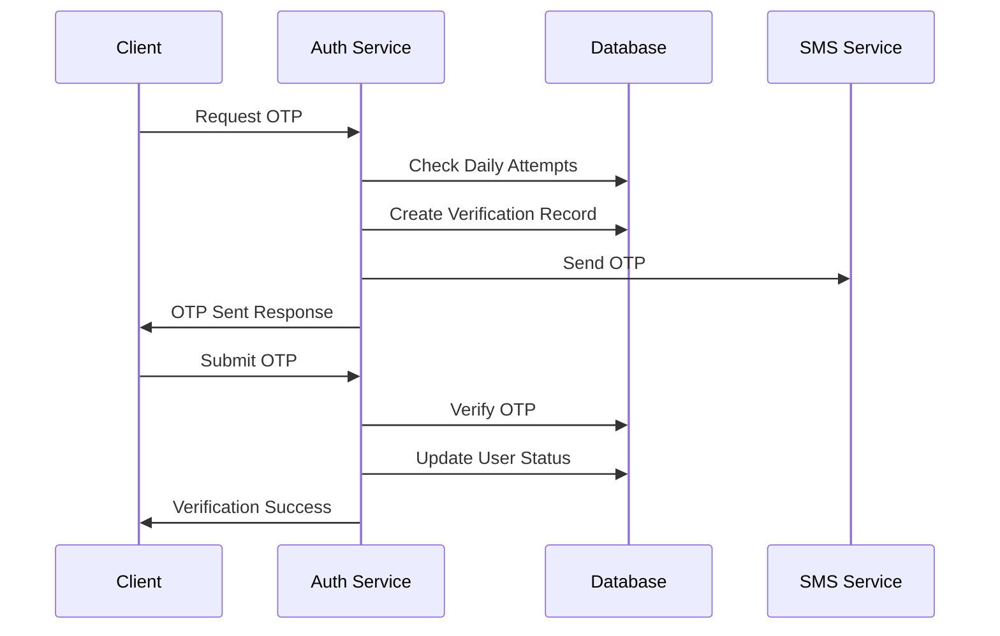

# Authentication Flow Documentation

## Overview

The authentication system uses a combination of phone verification and JWT tokens to secure the application. This document details the complete authentication flow, including phone verification, login process, and session management.

## 1. Phone Verification Flow



### OTP Generation
```javascript
{
  phoneNumber: "+9779841234567",
  otp: "123456",
  expiresAt: "2024-12-08T14:52:22Z",
  attempts: 0,
  dailyAttempts: 1
}
```

### Verification Rules
- OTP expires in 10 minutes
- Maximum 5 attempts per day
- Daily attempts reset at midnight
- Alternative phone numbers exempt

## 2. Login Process

### Phone Number Login
```javascript
// Request
{
  phoneNumber: "+9779841234567",
  password: "hashedPassword123"
}

// Response
{
  accessToken: "eyJhbG...",
  refreshToken: "eyJhbG...",
  expiresIn: 3600,
  user: {
    id: "USER123",
    name: "John Doe",
    role: "CUSTOMER"
  }
}
```

### Token Generation
- Access Token (1 hour validity)
- Refresh Token (7 days validity)
- Token includes user role and permissions

## 3. Session Management

### Token Verification
```javascript
// Token Payload
{
  userId: "USER123",
  role: "CUSTOMER",
  permissions: ["order:create", "profile:read"],
  exp: 1670509942,
  iat: 1670506342
}
```

### Session Rules
- Single active session per device
- Forced logout on password change
- Session tracking for security

## 4. Role-Based Access Control

### Role Hierarchy
```javascript
const roles = {
  ADMIN: {
    inherits: ["MANAGER"],
    permissions: ["user:manage", "system:configure"]
  },
  MANAGER: {
    inherits: ["STAFF"],
    permissions: ["inventory:manage", "staff:manage"]
  },
  STAFF: {
    inherits: [],
    permissions: ["order:process", "kitchen:manage"]
  },
  CUSTOMER: {
    inherits: [],
    permissions: ["order:create", "profile:manage"]
  }
}
```

## 5. Security Measures

### Password Security
- Bcrypt hashing
- Minimum 8 characters
- Complexity requirements
- History tracking

### Device Tracking
```javascript
{
  userId: "USER123",
  deviceId: "DEVICE456",
  deviceType: "Mobile",
  lastLogin: "2024-12-08T14:42:22Z",
  ipAddress: "192.168.1.1",
  location: "Kathmandu, Nepal"
}
```

### Security Alerts
```javascript
{
  type: "SUSPICIOUS_LOGIN",
  userId: "USER123",
  details: {
    reason: "Unknown location",
    severity: "HIGH",
    timestamp: "2024-12-08T14:42:22Z"
  }
}
```

## 6. Alternative Phone Numbers

### Management
```javascript
{
  userId: "USER123",
  primaryPhone: "+9779841234567",
  alternativePhones: [
    {
      number: "+9779867654321",
      label: "Home",
      verified: false
    }
  ]
}
```

## 7. Blacklist System

### Blacklist Record
```javascript
{
  userId: "USER123",
  status: "TEMPORARY",
  reason: "Multiple cancellations",
  startDate: "2024-12-08T14:42:22Z",
  endDate: "2024-12-15T14:42:22Z",
  history: [
    {
      status: "TEMPORARY",
      reason: "Payment issues",
      duration: "7 days",
      date: "2024-11-01T14:42:22Z"
    }
  ]
}
```

### Blacklist Rules
- 3 cancellations in 7 days
- 3 payment issues in a week
- 3 temporary blacklists → permanent
- Admin review for permanent

## 8. Audit Logging

### Authentication Logs
```javascript
{
  eventType: "AUTH_LOGIN",
  userId: "USER123",
  timestamp: "2024-12-08T14:42:22Z",
  details: {
    success: true,
    method: "PHONE",
    ipAddress: "192.168.1.1",
    deviceInfo: "Mozilla/5.0..."
  }
}
```

### Security Logs
```javascript
{
  level: "WARNING",
  category: "SECURITY",
  message: "Multiple failed login attempts",
  context: {
    userId: "USER123",
    attempts: 3,
    timeWindow: "5 minutes"
  }
}
```

## 9. Error Handling

### Authentication Errors
```javascript
{
  success: false,
  error: {
    code: "AUTH_FAILED",
    message: "Invalid credentials",
    details: {
      remainingAttempts: 2
    }
  }
}
```

### Verification Errors
```javascript
{
  success: false,
  error: {
    code: "OTP_INVALID",
    message: "Invalid or expired OTP",
    details: {
      remainingAttempts: 4,
      expiresIn: 300 // seconds
    }
  }
}
```
