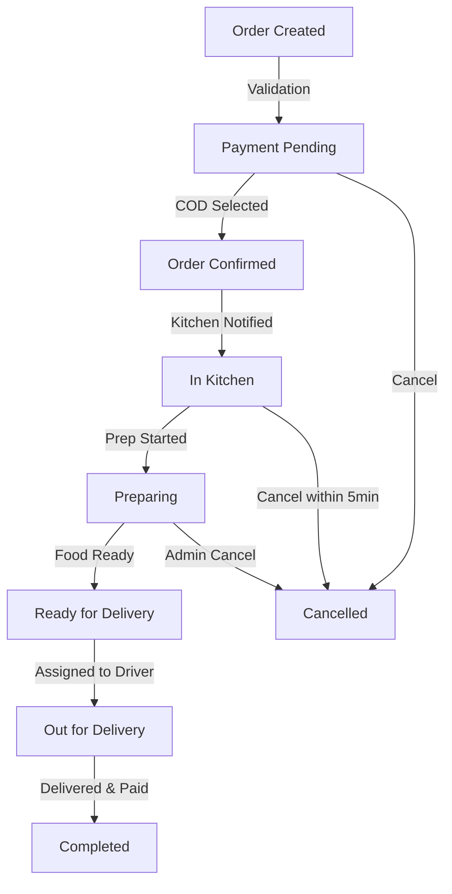

# Order Flow Documentation

## Order Lifecycle



## 1. Order Creation

### Customer Actions
1. Selects menu items
2. Specifies quantity
3. Adds special instructions
4. Chooses delivery address
5. Selects payment method (COD)

### System Validations
- Menu item availability
- Delivery address within range
- Customer blacklist status
- Order minimum/maximum values
- Restaurant operating hours

### Order Creation Process
```javascript
{
  orderId: "ORD123456",
  customerId: "CUST789",
  items: [
    {
      menuItemId: "ITEM001",
      quantity: 2,
      specialInstructions: "Extra spicy"
    }
  ],
  deliveryAddress: {
    address: "123 Street",
    coordinates: {
      lat: 27.7172,
      lng: 85.3240
    }
  },
  paymentMethod: "COD",
  orderStatus: "CREATED",
  createdAt: "2024-12-08T14:42:22Z"
}
```

## 2. Order Confirmation

### COD Process
1. Order placed without payment
2. Initial validation completed
3. Kitchen notification prepared
4. Status updated to "CONFIRMED"

### Kitchen Notification
```javascript
{
  notificationType: "NEW_ORDER",
  orderId: "ORD123456",
  priority: "NORMAL",
  items: [
    {
      name: "Chicken Momo",
      quantity: 2,
      specialInstructions: "Extra spicy"
    }
  ],
  estimatedPrepTime: 25 // minutes
}
```

## 3. Order Updates

### Update Window
- 10 minutes from order creation
- Maximum 3 update requests per order

### Update Process
1. Customer requests update
2. Staff reviews changes
3. Price recalculation
4. Order modification
5. All parties notified

### Update Request
```javascript
{
  requestId: "UPD123",
  orderId: "ORD123456",
  changes: {
    addItems: [{
      menuItemId: "ITEM002",
      quantity: 1
    }],
    removeItems: [{
      menuItemId: "ITEM001",
      quantity: 1
    }]
  },
  reason: "Changed mind about quantity"
}
```

## 4. Order Cancellation

### Cancellation Windows
1. **Pre-confirmation**: Any time
2. **Post-confirmation**: Within 5 minutes
3. **In-Kitchen**: Admin approval required

### Cancellation Process
1. Cancellation request received
2. Time window validated
3. Approval process (if required)
4. Order status updated
5. Notifications sent

### Cancellation Request
```javascript
{
  orderId: "ORD123456",
  reason: "Changed mind",
  timestamp: "2024-12-08T14:47:22Z",
  status: "CANCELLED",
  approvalRequired: false
}
```

## 5. Kitchen Processing

### Kitchen States
1. **Queued**: Order waiting
2. **In Progress**: Preparation started
3. **Quality Check**: Final verification
4. **Ready**: Prepared and packed

### Kitchen Updates
```javascript
{
  orderId: "ORD123456",
  kitchenStatus: "IN_PROGRESS",
  startTime: "2024-12-08T14:52:22Z",
  estimatedCompletion: "2024-12-08T15:17:22Z",
  assignedStaff: "STAFF123"
}
```

## 6. Delivery Process

### Delivery Assignment
1. Order marked ready
2. Nearby drivers notified
3. Driver accepts order
4. Pickup process starts

### Delivery Tracking
```javascript
{
  orderId: "ORD123456",
  driverId: "DRV789",
  status: "PICKED_UP",
  currentLocation: {
    lat: 27.7172,
    lng: 85.3240
  },
  estimatedDelivery: "2024-12-08T15:32:22Z"
}
```

## 7. Order Completion

### Completion Process
1. Driver arrives at location
2. Collects COD payment
3. Confirms delivery
4. Order marked complete

### Completion Record
```javascript
{
  orderId: "ORD123456",
  deliveryTime: "2024-12-08T15:30:22Z",
  paymentCollected: true,
  paymentAmount: 850.00,
  customerSignature: true,
  deliveryPhoto: "delivery123.jpg"
}
```

## 8. Post-Order Processing

### System Updates
1. Update inventory
2. Process analytics
3. Update customer metrics
4. Generate reports

### Analytics Data
```javascript
{
  orderId: "ORD123456",
  preparationTime: 25,
  deliveryTime: 15,
  totalTime: 40,
  customerRating: 4.5,
  feedback: "Great service!"
}
```
