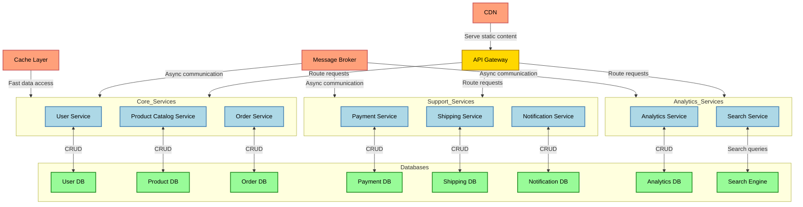

# Enhanced Microservices-based eCommerce System Development Documentation

## Table of Contents
1. [Overview](#overview)
2. [Architecture](#architecture)
3. [Technology Stack](#technology-stack)
4. [Microservices](#microservices)
5. [Communication Between Microservices](#communication-between-microservices)
6. [API Gateway](#api-gateway)
7. [Event-Driven Communication](#event-driven-communication)
8. [Database and Persistence](#database-and-persistence)
9. [Service Discovery](#service-discovery)
10. [Deployment](#deployment)
11. [Security](#security)
12. [Monitoring and Logging](#monitoring-and-logging)
13. [CI/CD Integration](#cicd-integration)
14. [Scalability and Best Practices](#scalability-and-best-practices)
15. [Performance Optimization](#performance-optimization)
16. [Disaster Recovery and Business Continuity](#disaster-recovery-and-business-continuity)
17. [Compliance and Data Protection](#compliance-and-data-protection)
18. [Internationalization and Localization](#internationalization-and-localization)
19. [Analytics and Reporting](#analytics-and-reporting)
20. [Mobile and Omnichannel Strategy](#mobile-and-omnichannel-strategy)
21. [Future Enhancements](#future-enhancements)

## Overview
This documentation outlines the architecture, technology stack, and development practices for a robust, scalable, and secure eCommerce system built using microservices. The system is designed to manage a large-scale online store that supports user authentication, product management, order processing, payment integration, shipping, and notifications. The architecture emphasizes flexibility, fault-tolerance, and ease of scalability.

## Architecture
The system follows a microservices-based architecture where each service performs a specific function. These services are independent, self-contained, and communicate with each other through well-defined APIs. The architecture ensures:

- Loose coupling between services.
- Independent deployment, scaling, and maintenance of each service.
- Fault tolerance and better management of failures.
- Ease of scaling individual services as required by the system load.

### Diagram

## Technology Stack
- **Backend:**
  - Node.js (NestJS) for high-performance, scalable microservices
  - Python (FastAPI) for data processing and machine learning tasks
  - GoLang for performance-critical services
- **Frontend:**
  - Next.js for server-side rendering and improved SEO
  - React Native for mobile app development
- **Database:**
  - PostgreSQL for transactional data (users, orders)
  - MongoDB for product catalog and flexible schema requirements
  - Redis for caching and session management
- **Message Broker:** Apache Kafka for high-throughput event streaming
- **API Gateway:** Kong for advanced routing, authentication, and rate limiting
- **Containerization:** Docker and Kubernetes for orchestration
- **Authentication:** OAuth2 with OpenID Connect for secure, standardized authentication
- **Logging & Monitoring:** ELK Stack, Prometheus, Grafana, and Jaeger for distributed tracing
- **Search:** Elasticsearch for fast, scalable full-text search capabilities
- **CDN:** Cloudflare for global content delivery and DDoS protection

## Microservices
Each service has its own database and is independently deployed, allowing updates without affecting other services. Here are the core microservices:

1. **User Service**: Handles user registration, login, and profile management.
   - **Features**:
     - User registration and login.
     - Password management (reset, update).
     - User profiles and session handling.
     - Role-based access control (admin, customer).
   - **Endpoints**:
     - `POST /users/register`: Register a new user.
     - `POST /users/login`: Authenticate a user.
     - `GET /users/profile`: Retrieve user profile data.
     - `PUT /users/update`: Update user profile.

2. **Product Catalog Service**: Manages products, categories, and inventory.
   - **Features**:
     - Product creation, updating, and deletion.
     - Inventory management (real-time stock status).
     - Product categories, tags, and filtering.
     - Product reviews and ratings.
   - **Endpoints**:
     - `GET /products`: List all products.
     - `POST /products`: Add a new product (admin).
     - `PUT /products/:id`: Update product details (admin).
     - `DELETE /products/:id`: Delete a product (admin).

3. **Order Service**: Processes and manages customer orders.
   - **Features**:
     - Create new orders.
     - Update order status (pending, processing, shipped, delivered).
     - Manage returns and refunds.
     - Maintain order history for users.
   - **Endpoints**:
     - `POST /orders`: Place a new order.
     - `GET /orders/:id`: Retrieve order details.
     - `PUT /orders/:id/status`: Update order status (admin).

4. **Payment Service**: Integrates with third-party payment providers.
   - **Features**:
     - Payment initiation and confirmation.
     - Integration with third-party payment gateways.
     - Handling of payment failures, refunds, and disputes.
     - Support for multiple payment methods (credit card, bank transfer).
   - **Endpoints**:
     - `POST /payment/checkout`: Initiate payment.
     - `GET /payment/status`: Check payment status.
     - `POST /payment/refund`: Initiate a refund.

5. **Shipping Service**: Manages shipping logistics and delivery tracking.
   - **Features**:
     - Integration with external shipping carriers (DHL, FedEx).
     - Calculate shipping costs.
     - Manage tracking numbers.
     - Update shipping status.
   - **Endpoints**:
     - `POST /shipping/calculate`: Calculate shipping cost.
     - `POST /shipping/track`: Track the shipping status of an order.

6. **Notification Service**: Handles all user notifications, including email, SMS, and push notifications.
   - **Features**:
     - Send order confirmations.
     - Notify users of order updates.
     - Push notifications for promotional offers.
   - **Endpoints**:
     - `POST /notifications/send`: Send a new notification.
     - `GET /notifications/history`: Retrieve notification history for a user.

7. **Analytics Service**: Collects and processes data for business intelligence.
   - **Features**:
     - Real-time data collection and processing.
     - Generation of business insights and reports.
     - Integration with BI tools.
   - **Endpoints**:
     - `POST /analytics/event`: Log an analytics event.
     - `GET /analytics/report`: Generate custom reports.

8. **Search Service**: Provides fast and relevant search functionality across products.
   - **Features**:
     - Full-text search across product catalog.
     - Faceted search and filtering.
     - Search result ranking and relevance tuning.
   - **Endpoints**:
     - `GET /search`: Perform a search query.
     - `POST /search/index`: Index or update search documents.

## Communication Between Microservices
Services communicate using REST APIs for synchronous communication and event-driven messaging (Kafka) for asynchronous communication.

### Patterns Used:
- **Synchronous (HTTP/REST)**: API Gateway calls specific microservices (e.g., User Service, Product Catalog).
- **Asynchronous (Messaging)**: Event-driven architecture using Kafka for order events, payment status updates, etc.

### API Versioning
Implement API versioning to ensure backward compatibility:
- Use URI versioning (e.g., `/v1/users`, `/v2/users`)
- Implement feature flags for gradual rollout of new API versions

### Circuit Breaker Pattern
Implement circuit breakers (e.g., using Hystrix) to prevent cascading failures:
- Open circuit: When a service is unavailable, preventing further calls
- Half-open: Allowing a limited number of calls to test service recovery
- Closed circuit: Normal operation when service is healthy

## API Gateway
The API Gateway serves as the entry point to the system, routing requests to the appropriate microservices and managing concerns like authentication and rate limiting.

- **Features**:
  - Authentication and authorization.
  - Routing to appropriate microservices.
  - Load balancing and rate limiting.
  - API monitoring and metrics.
  - API composition for aggregating data from multiple services
  - Request transformation and response manipulation
  - A/B testing support for gradual feature rollout

## Event-Driven Communication
An event-driven architecture ensures that services remain decoupled and can scale independently. Events such as "Order Placed," "Payment Completed," or "Shipping Updated" are published to an event stream and consumed by relevant microservices.

- **Message Broker**: Apache Kafka
- **Event Types**:
  - `OrderCreated`
  - `PaymentProcessed`
  - `ShippingUpdated`
  - `ProductUpdated`
  - `UserRegistered`

- **Event Sourcing:** Implement event sourcing for critical business processes to maintain a complete history of state changes.
- **CQRS (Command Query Responsibility Segregation):** Separate read and write operations for complex domains to optimize performance and scalability.

## Database and Persistence
Each service manages its own database, following the **Database per Service** pattern.

- **User Service**: PostgreSQL
- **Product Catalog Service**: MongoDB
- **Order Service**: PostgreSQL
- **Payment Service**: PostgreSQL
- **Shipping Service**: MongoDB
- **Analytics Service**: ClickHouse for OLAP workloads
- **Search Service**: Elasticsearch

**Polyglot Persistence:** Use the most appropriate database for each service's needs:
  - PostgreSQL with PostGIS extension for location-based services
  - Neo4j for product recommendations based on graph relationships
**Data Replication:** Implement multi-region replication for disaster recovery and low-latency global access.

## Service Discovery
Service discovery ensures microservices can dynamically locate one another in the system. Use Consul for service registration and discovery.

- Implement health checks and circuit breakers to ensure reliable service discovery.
- Use DNS-based service discovery for simplified configuration in cloud environments.

## Deployment
Deployment is managed using **Docker** for containerization and **Kubernetes** for orchestration. Kubernetes handles scaling, load balancing, and fault tolerance.

- **CI/CD Pipeline**: GitHub Actions for continuous integration and delivery.
- **Deployment Models**: Blue-Green or Canary deployments.
- **Infrastructure as Code:** Use Terraform for provisioning and managing cloud resources.
- **GitOps:** Implement GitOps principles using ArgoCD for declarative, version-controlled deployments.
- **Feature Flags:** Utilize feature flags for controlled feature releases and A/B testing.

## Security
Security best practices include:

- **Authentication**: Using OAuth2 with OpenID Connect for securing APIs.
- **Authorization**: Role-based access control (RBAC) for admin and user segregation.
- **Data Encryption**: TLS/SSL encryption for all communication.
- **Security Testing**: Regular vulnerability scanning and patch management.
- **API Security:** Implement OAuth 2.0 with JWT for stateless authentication and authorization.
- **Secrets Management:** Use HashiCorp Vault for secure secrets management.
- **Container Security:** Implement container image scanning and runtime security monitoring.
- **DDoS Protection:** Utilize cloud-native DDoS protection services and implement rate limiting at the API Gateway.

## Monitoring and Logging
A centralized logging and monitoring system helps in tracking system health and performance.

- **Logging**: Use the ELK stack (Elasticsearch, Logstash, Kibana).
- **Monitoring**: Prometheus for metrics collection and Grafana for dashboards.
- **Tracing**: Jaeger for distributed tracing.
- **Anomaly Detection:** Implement machine learning-based anomaly detection for proactive issue identification.
- **Log Analysis:** Use log analysis tools like Splunk or Sumo Logic for advanced log analytics and correlation.
- **Real-time Alerting:** Set up PagerDuty or OpsGenie for incident management and on-call rotations.

## CI/CD Integration
Continuous Integration/Continuous Deployment pipelines ensure that code is tested, built, and deployed automatically.

- **Pipeline Tools**: GitHub Actions
- **Stages**:
  - Code build
  - Unit and integration testing
  - Automated deployment to staging and production environments
- **Infrastructure Testing:** Implement infrastructure testing using tools like Terratest.
- **Security Scanning:** Integrate SAST (Static Application Security Testing) and DAST (Dynamic Application Security Testing) tools into the CI/CD pipeline.
- **Chaos Engineering:** Implement chaos engineering practices using tools like Chaos Monkey to test system resilience.

## Scalability and Best Practices
Key considerations for scalability:

- **Horizontal Scaling**: Use Kubernetes to horizontally scale microservices based on load.
- **Load Balancing**: Leverage NGINX or HAProxy for distributing requests.
- **Database Sharding**: Apply sharding techniques to handle large datasets.
- **Caching**: Use Redis for in-memory caching of frequently accessed data.
- **Failover and Redundancy**: Use replication and backup strategies for database and services.
- **Auto-scaling:** Implement predictive auto-scaling based on historical data and machine learning models.
- **Global Load Balancing:** Use DNS-based global load balancing for multi-region deployments.
- **Content Delivery Network (CDN):** Implement a CDN for static assets and API caching to reduce latency and improve performance.

## Performance Optimization
- **API Optimization:** Implement GraphQL for flexible, efficient data fetching.
- **Lazy Loading:** Use lazy loading techniques for images and content to improve initial page load times.
- **Database Query Optimization:** Regularly analyze and optimize database queries, implement indexing strategies.
- **Compression:** Use Brotli or Gzip compression for API responses and static assets.

## Disaster Recovery and Business Continuity
- **Multi-Region Deployment:** Implement active-active or active-passive multi-region deployments.
- **Regular Backups:** Automate regular backups with point-in-time recovery capabilities.
- **Disaster Recovery Drills:** Conduct regular DR drills to ensure recovery processes are effective.

## Compliance and Data Protection
- **GDPR Compliance:** Implement data protection measures to comply with GDPR and other relevant regulations.
- **PCI DSS:** Ensure PCI DSS compliance for secure handling of payment card data.
- **Data Encryption:** Implement encryption at rest and in transit for all sensitive data.

## Internationalization and Localization
- **Multi-language Support:** Implement a robust i18n framework for supporting multiple languages.
- **Currency Conversion:** Provide real-time currency conversion for international customers.
- **Regional Pricing:** Implement regional pricing strategies and tax calculations.

## Analytics and Reporting
- **Real-time Analytics:** Implement real-time analytics using tools like Apache Flink or Spark Streaming.
- **Business Intelligence:** Integrate with BI tools like Tableau or Power BI for advanced reporting.
- **Customer Segmentation:** Implement machine learning models for customer segmentation and personalization.

## Mobile and Omnichannel Strategy
- **Progressive Web App (PWA):** Develop a PWA for a native-like mobile experience without requiring app installation.
- **Mobile Apps:** Develop native mobile apps using React Native for iOS and Android.
- **Omnichannel Experience:** Ensure consistency across web, mobile, and potential physical store integrations.
  - Implement a unified customer profile that synchronizes across all channels.
  - Provide seamless cart and wishlist synchronization between devices.
  - Enable in-store pickup options for online orders.
  - Implement QR code scanning in physical stores to access product information and reviews.

- **Push Notifications:** Implement a robust push notification system for mobile apps.
  - Use Firebase Cloud Messaging (FCM) for Android and Apple Push Notification Service (APNs) for iOS.
  - Segment users and personalize notifications based on their browsing and purchase history.
  - Implement rich notifications with images and action buttons.

- **Offline Capabilities:** Enhance mobile apps with offline functionality.
  - Cache product information and images for offline browsing.
  - Allow users to add items to cart offline and sync when back online.
  - Implement offline order tracking.

- **Mobile-specific Features:**
  - Integrate device capabilities like camera for barcode scanning and AR features.
  - Implement mobile wallet integration (Apple Pay, Google Pay) for seamless checkout.
  - Use geolocation for store finders and location-based offers.

## Future Enhancements

### AI-powered Recommendations
- Implement machine learning models for personalized product recommendations.
  - Use collaborative filtering and content-based filtering techniques.
  - Integrate with the Product Catalog and User Service to gather necessary data.
  - Use technologies like TensorFlow or PyTorch for model training and inference.
  - Implement A/B testing framework to continuously improve recommendation algorithms.

### Voice Commerce
- Develop integrations with voice assistants for voice-based shopping experiences.
  - Create Alexa Skills and Google Actions for voice-based product search and ordering.
  - Implement natural language processing (NLP) to understand and process voice commands.
  - Ensure voice commerce adheres to the same security and privacy standards as other channels.

### Augmented Reality (AR)
- Implement AR features for product visualization.
  - Develop "virtual try-on" features for fashion items using ARKit (iOS) and ARCore (Android).
  - Create AR-based furniture placement feature to visualize items in customers' homes.
  - Implement 3D product viewing for complex products.

### Blockchain Integration
- Explore blockchain for supply chain transparency and loyalty programs.
  - Implement a private blockchain network (e.g., Hyperledger Fabric) for supply chain tracking.
  - Develop smart contracts for automated supplier payments and inventory management.
  - Create a blockchain-based loyalty program with tokenized rewards.

### Social Commerce Integration
- Integrate social media platforms for seamless shopping experiences.
  - Implement "Shop Now" features on Instagram and Facebook posts.
  - Develop chatbots for Facebook Messenger and WhatsApp to handle customer queries and orders.
  - Create shoppable live streams on platforms like YouTube and TikTok.

### Subscription-based Services
- Implement a subscription model for recurring purchases.
  - Develop a flexible subscription management system integrated with the Order and Payment services.
  - Implement features like pause, skip, or modify subscriptions.
  - Create analytics dashboards for subscription metrics (churn rate, lifetime value, etc.).

### Advanced Search and Discovery
- Enhance product discovery with AI and machine learning.
  - Implement visual search allowing users to find products by uploading images.
  - Develop a recommendation engine that considers current trends and seasonal factors.
  - Implement personalized search results based on user behavior and preferences.

### Sustainable eCommerce Features
- Integrate features promoting sustainability.
  - Implement carbon footprint calculation for each order.
  - Offer carbon offset options at checkout.
  - Highlight eco-friendly products and sustainable practices in the product catalog.

### Integration with Internet of Things (IoT)
- Explore IoT integration for enhanced customer experiences and operational efficiency.
  - Implement automated reordering for connected devices (e.g., smart refrigerators).
  - Develop IoT-based inventory management in warehouses.
  - Create a network of smart lockers for convenient product pickup and returns.

### Advanced Customer Support
- Implement AI-driven customer support solutions.
  - Develop an AI chatbot using natural language processing for handling common queries.
  - Implement sentiment analysis on customer communications for proactive issue resolution.
  - Create a knowledge base with machine learning-powered search for self-service support.

## Conclusion

This comprehensive documentation provides a robust framework for developing and maintaining a state-of-the-art eCommerce system. By leveraging microservices architecture, cutting-edge technologies, and forward-thinking strategies, this system is designed to be scalable, resilient, and adaptable to future market demands.

Key points to remember:
1. The microservices architecture allows for independent scaling and updating of individual components.
2. A strong emphasis on security, performance, and scalability ensures the system can handle high loads and protect sensitive data.
3. The integration of AI, machine learning, and emerging technologies prepares the system for future eCommerce trends.
4. Continuous monitoring, testing, and improvement processes are crucial for maintaining system health and adapting to changing requirements.

As the eCommerce landscape continues to evolve, regular reviews and updates to this system will be necessary. Stay informed about emerging technologies and changing consumer behaviors to ensure the system remains competitive and provides excellent user experiences.